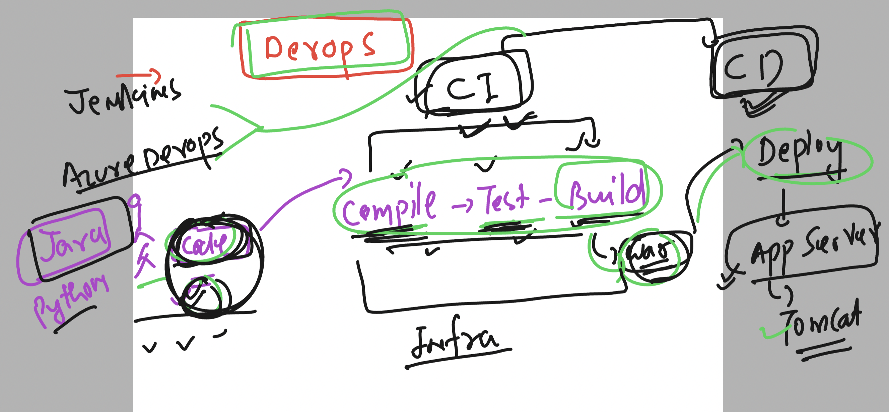

# devops-app_design_USA

### Understanding CICD for making developer and deployment engineer process automation 



### connecting to sample lab ENV

```
PS C:\vsts-agent-win-x64-3.234.0> ssh  ashu@3.13.94.78
The authenticity of host '3.13.94.78 (3.13.94.78)' can't be established.
ECDSA key fingerprint is SHA256:XvU/SvKC/yXD42AKbCRevAYnaqha53gOLbnV/dT3OnY.
Are you sure you want to continue connecting (yes/no/[fingerprint])? yes
Warning: Permanently added '3.13.94.78' (ECDSA) to the list of known hosts.
ashu@3.13.94.78's password:
   ,     #_
   ~\_  ####_        Amazon Linux 2
  ~~  \_#####\
  ~~     \###|       AL2 End of Life is 2025-06-30.
  ~~       \#/ ___
   ~~       V~' '->
    ~~~         /    A newer version of Amazon Linux is available!
      ~~._.   _/
         _/ _/       Amazon Linux 2023, GA and supported until 2028-03-15.
       _/m/'           https://aws.amazon.com/linux/amazon-linux-2023/

[ashu@ip-172-31-23-52 ~]$ whoami
ashu
[ashu@ip-172-31-23-52 ~]$
```

