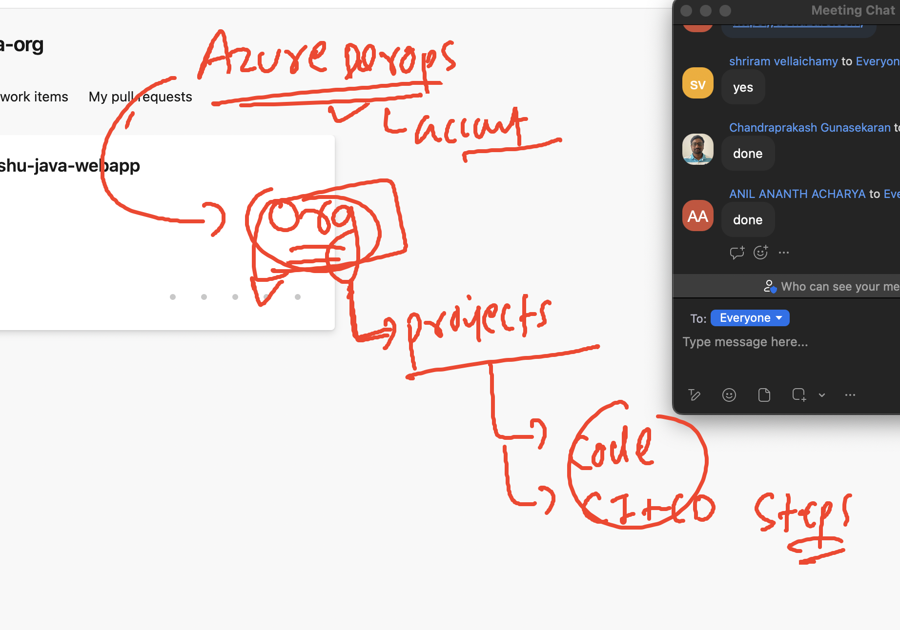
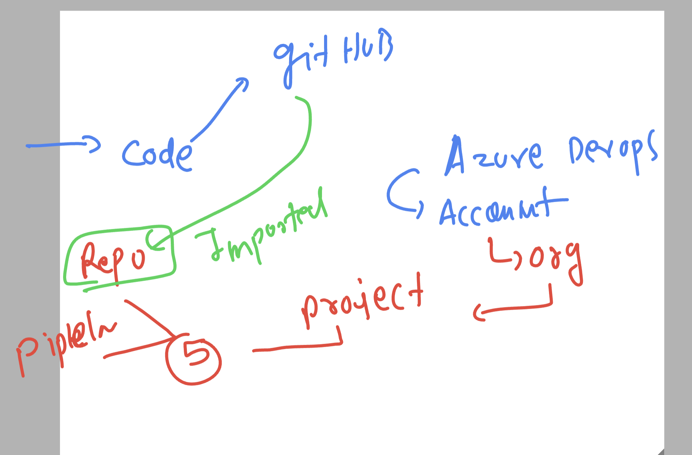
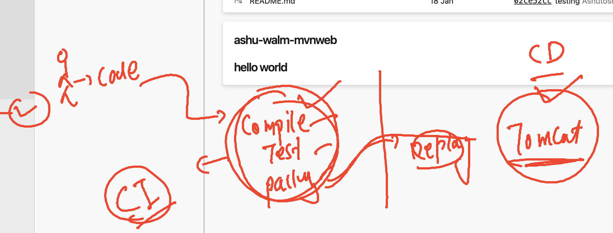

# devops-app_design_USA

### Understanding CICD for making developer and deployment engineer process automation 


### connecting to sample lab ENV

```
PS C:\vsts-agent-win-x64-3.234.0> ssh  ashu@3.13.94.78
The authenticity of host '3.13.94.78 (3.13.94.78)' can't be established.
ECDSA key fingerprint is SHA256:XvU/SvKC/yXD42AKbCRevAYnaqha53gOLbnV/dT3OnY.
Are you sure you want to continue connecting (yes/no/[fingerprint])? yes
Warning: Permanently added '3.13.94.78' (ECDSA) to the list of known hosts.
ashu@3.13.94.78's password:
   ,     #_
   ~\_  ####_        Amazon Linux 2
  ~~  \_#####\
  ~~     \###|       AL2 End of Life is 2025-06-30.
  ~~       \#/ ___
   ~~       V~' '->
    ~~~         /    A newer version of Amazon Linux is available!
      ~~._.   _/
         _/ _/       Amazon Linux 2023, GA and supported until 2028-03-15.
       _/m/'           https://aws.amazon.com/linux/amazon-linux-2023/

[ashu@ip-172-31-23-52 ~]$ whoami
ashu
[ashu@ip-172-31-23-52 ~]$
```

### clone java webapp to personal user 

```
git clone  https://github.com/redashu/ashu-walm-mvnweb.git
Cloning into 'ashu-walm-mvnweb'...
remote: Enumerating objects: 118, done.
remote: Counting objects: 100% (27/27), done.
remote: Compressing objects: 100% (21/21), done.
remote: Total 118 (delta 11), reused 4 (delta 4), pack-reused 91
Receiving objects: 100% (118/118), 16.77 KiB | 2.79 MiB/s, done.
Resolving deltas: 100% (37/37), done.
[ashu@ip-172-31-23-52 ~]$ ls
ashu-walm-mvnweb
[ashu@ip-172-31-23-52 ~]$ 


```

### 

```
[ashu@ip-172-31-23-52 ~]$ ls
ashu-walm-mvnweb
[ashu@ip-172-31-23-52 ~]$ cd  ashu-walm-mvnweb/
[ashu@ip-172-31-23-52 ashu-walm-mvnweb]$ ls
azure-pipelines.yml  pom.xml  README.md  src
[ashu@ip-172-31-23-52 ashu-walm-mvnweb]$ 


```

### compiling and building code using maven 

```
4  cd  ashu-walm-mvnweb/
    5  ls
    6  mvn install 
    7  ls
    8  ls target/

```

### Introduction to azure devops tool -- 



### azure devops project has 5 things 


### importing github repo to azure repo 



### azure devops pipeline 




