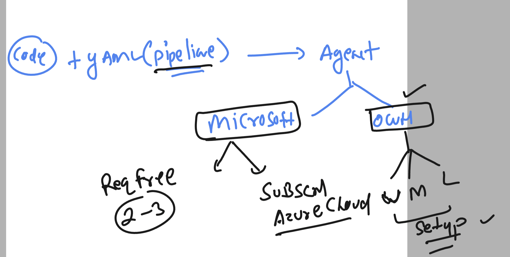
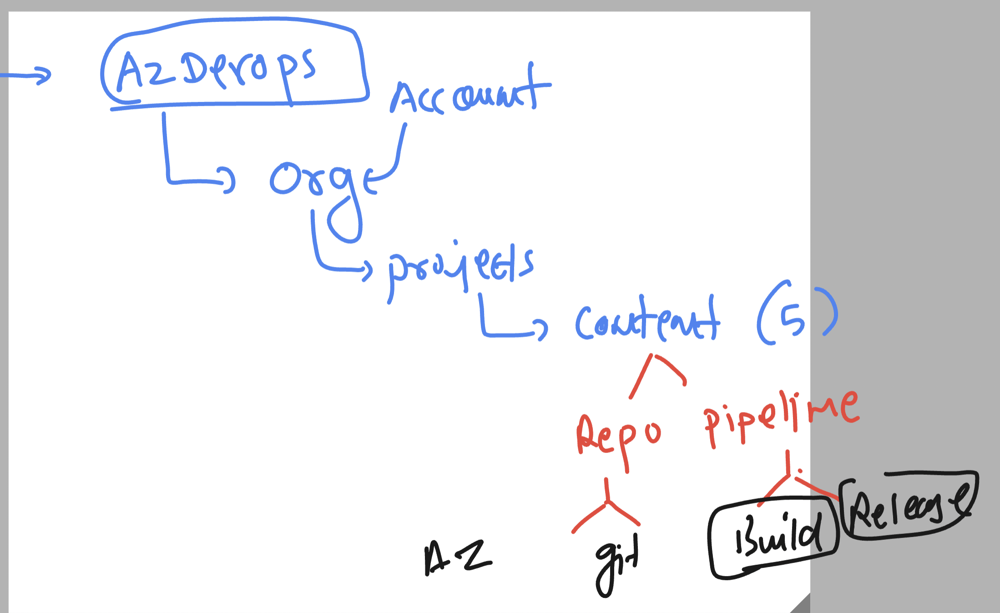
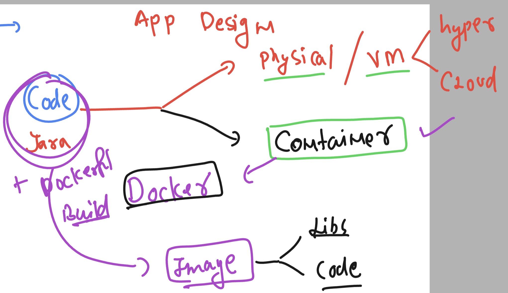
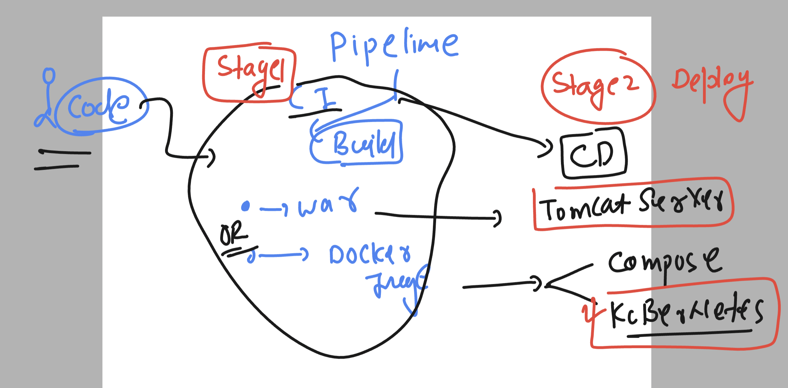

## azure devosp rev



### more understanding 



### azure devops yaml file with custom pool 

```
# Maven
# Build your Java project and run tests with Apache Maven.
# Add steps that analyze code, save build artifacts, deploy, and more:
# https://docs.microsoft.com/azure/devops/pipelines/languages/java

trigger:
- master

pool: Default # our custom agent 
#  vmImage: ubuntu-latest # this agent is from azure cloud 

steps:
- task: Maven@3
  inputs:
    mavenPomFile: 'pom.xml'
    mavenOptions: '-Xmx3072m'
    javaHomeOption: 'JDKVersion'
    jdkVersionOption: '1.8'
    jdkArchitectureOption: 'x64'
    publishJUnitResults: true
    testResultsFiles: '**/surefire-reports/TEST-*.xml'
    goals: 'package'

```

### containerization of java app



### adding dockerfile to current project

```
FROM oraclelinux:8.4
LABEL name=ashutoshh
RUN dnf install java-1.8.0-openjdk.x86_64  java-1.8.0-openjdk-devel.x86_64  maven  -y 
WORKDIR /ashu-java
COPY .  . 
# now running maven to create .war file 
RUN mvn install 
```

### adding azurepipeline to run dockerfile to build and image

```
# Maven
# Build your Java project and run tests with Apache Maven.
# Add steps that analyze code, save build artifacts, deploy, and more:
# https://docs.microsoft.com/azure/devops/pipelines/languages/java

trigger:
- master

pool: Default # our custom agent 
#  vmImage: ubuntu-latest # this agent is from azure cloud 

steps:
- task: Maven@3
  inputs:
    mavenPomFile: 'pom.xml'
    mavenOptions: '-Xmx3072m'
    javaHomeOption: 'JDKVersion'
    jdkVersionOption: '1.8'
    jdkArchitectureOption: 'x64'
    publishJUnitResults: true
    testResultsFiles: '**/surefire-reports/TEST-*.xml'
    goals: 'package'
    
    # adding to build docker image 
- task: Docker@2
  inputs:
    repository: 'ashu-walm-javaapp'
    command: 'build'
    Dockerfile: '**/Dockerfile'


```

### adding build and push

```
# Maven
# Build your Java project and run tests with Apache Maven.
# Add steps that analyze code, save build artifacts, deploy, and more:
# https://docs.microsoft.com/azure/devops/pipelines/languages/java

trigger:
- master

pool: Default # our custom agent 
#  vmImage: ubuntu-latest # this agent is from azure cloud 

steps:
- task: Maven@3
  inputs:
    mavenPomFile: 'pom.xml'
    mavenOptions: '-Xmx3072m'
    javaHomeOption: 'JDKVersion'
    jdkVersionOption: '1.8'
    jdkArchitectureOption: 'x64'
    publishJUnitResults: true
    testResultsFiles: '**/surefire-reports/TEST-*.xml'
    goals: 'package'
    
    # adding to build docker image 
- task: Docker@2
  inputs:
    containerRegistry: 'ashu-dockerhub-creds'
    repository: 'dockerashu/ashu-walm-javaapp'
    command: 'buildAndPush'
    Dockerfile: '**/Dockerfile'


```

### Understanding 2 stages of pipeline



### final azurepipeline with multistage

```
# Maven
# Build your Java project and run tests with Apache Maven.
# Add steps that analyze code, save build artifacts, deploy, and more:
# https://docs.microsoft.com/azure/devops/pipelines/languages/java

trigger:
- master

pool: Default # our custom agent 
#  vmImage: ubuntu-latest # this agent is from azure cloud 

stages: 
- stage: build 
  jobs:
  - job: usingmavenanddockerfile 
    steps:
    - task: Maven@3
      inputs:
        mavenPomFile: 'pom.xml'
        mavenOptions: '-Xmx3072m'
        javaHomeOption: 'JDKVersion'
        jdkVersionOption: '1.8'
        jdkArchitectureOption: 'x64'
        publishJUnitResults: true
        testResultsFiles: '**/surefire-reports/TEST-*.xml'
        goals: 'package'
        
        # adding to build docker image 
    - task: Docker@2
      inputs:
        containerRegistry: 'ashu-dockerhub-creds'
        repository: 'dockerashu/ashu-walm-javaapp'
        command: 'buildAndPush'
        Dockerfile: '**/Dockerfile'
- stage: Deploy
  jobs:
  - job: deployusingcompose 
    steps:
    - script: | 
        echo 'hey we are ready to deploy container images'
        echo 'for that we need to under kubernetes'


```

### adding k8s deploy stage using yaml manifest file 

```
# Maven
# Build your Java project and run tests with Apache Maven.
# Add steps that analyze code, save build artifacts, deploy, and more:
# https://docs.microsoft.com/azure/devops/pipelines/languages/java

trigger:
- master

pool: 
   vmImage: ubuntu-latest # this agent is from azure cloud 

stages: 
- stage: build 
  jobs:
  - job: usingmavenanddockerfile 
    steps:
    - task: Maven@3
      inputs:
        mavenPomFile: 'pom.xml'
        mavenOptions: '-Xmx3072m'
        javaHomeOption: 'JDKVersion'
        jdkVersionOption: '1.8'
        jdkArchitectureOption: 'x64'
        publishJUnitResults: true
        testResultsFiles: '**/surefire-reports/TEST-*.xml'
        goals: 'package'
        
        # adding to build docker image 
    - task: Docker@2
      inputs:
        containerRegistry: 'ashu-dockerhub-creds'
        repository: 'dockerashu/ashu-walm-javaapp'
        command: 'buildAndPush'
        Dockerfile: '**/Dockerfile'
- stage: Deploy
  jobs:
  - job: deployusingcompose 
    steps:
    - script: | 
        echo 'hey we are ready to deploy container images'
        echo 'for that we need to under kubernetes'

    - task: KubernetesManifest@1
      inputs:
        action: 'deploy'
        connectionType: 'kubernetesServiceConnection'
        kubernetesServiceConnection: 'azure-kubernetes'
        manifests: 'k8s-manifest/deploy.yaml'


```
