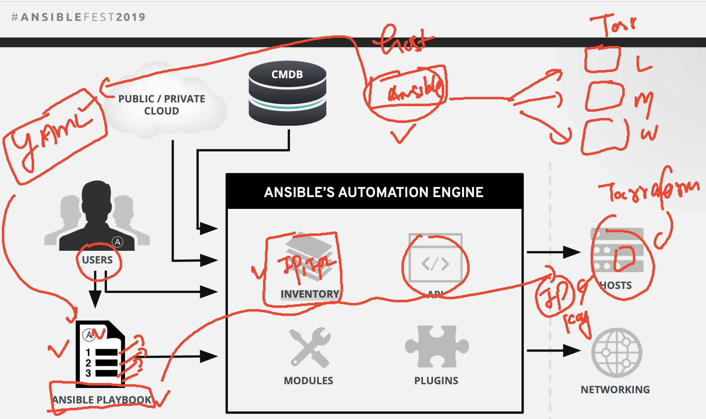

# ANsible basic understanding 



### code -- maven -- terraform -- ansible 

### terraform code 

```
# setting target cloud by terraform 

provider "aws" {
   region = "us-east-1"
}

# lets plan what resources i want to create 

resource "tls_private_key" "ashu" {
  algorithm = "RSA"
  rsa_bits  = 4096
}

resource "aws_key_pair" "ashu_key" {
  key_name   = "ashu_walmusa"
  public_key = tls_private_key.ashu.public_key_openssh
  provisioner "local-exec" { # Create "myKey.pem" to your computer!!
    command = "echo '${tls_private_key.ashu.private_key_pem}' > ~/ashu-walmUSA.pem"
  }
}

# creating Virtual machine using this above key 

resource "aws_instance" "ashuvm1" {

    ami = "ami-07761f3ae34c4478d"
    instance_type = "t2.micro"

    key_name = "ashu_walmusa"
    tags = {
      "Name" = "ashu-vm-by-terraform"
    }
    provisioner "local-exec" {
    command = "echo [hello] >~/ashuvmusa.txt && echo '${aws_instance.ashuvm1.public_ip}' >> ~/ashuvmusa.txt"
  }

}

```

### ansible playbook 

```
---
- name: Install and Start Apache Tomcat
  hosts: all
  remote_user: ec2-user # target machine username 
  become: yes # if required then get root access

  vars:
    tomcat_version: "9.0.86"

  tasks:
    - name: Install Tomcat dependencies
      package:
        name:
          - unzip
          - wget

    - name: Download Apache Tomcat
      get_url:
        url: "https://dlcdn.apache.org/tomcat/tomcat-9/v9.0.86/bin/apache-tomcat-9.0.86.tar.gz"
        dest: "/tmp/apache-tomcat.tar.gz"

    - name:  installing jdk 
      yum:
       name: java-1.8*
       state: present
       
    - name: Extract Tomcat archive
      ansible.builtin.unarchive:
        src: "/tmp/apache-tomcat.tar.gz"
        dest: "/opt"
        remote_src: yes

      
    - name: Start Tomcat service
      command: "chmod 755 /opt/apache-tomcat-9.0.86/ -R"

    - name: Start Tomcat service
      command: "nohup /opt/apache-tomcat-9.0.86/bin/startup.sh"

    - name: copy war file target tomcat server
      copy:
        src: /tmp/ashuwar/ashuwebjava.war
        dest: /opt/apache-tomcat-9.0.86/webapps/ashuwebjava.war


```

### azure pipeline yaml 

```
# Maven
# Build your Java project and run tests with Apache Maven.
# Add steps that analyze code, save build artifacts, deploy, and more:
# https://docs.microsoft.com/azure/devops/pipelines/languages/java

trigger:
- master

pool: Default 
  # vmImage: ubuntu-latest

stages:
- stage: build
  jobs:
  - job: maventowar
    steps:
    - task: Maven@3
      inputs:
        mavenPomFile: 'pom.xml'
        mavenOptions: '-Xmx3072m'
        javaHomeOption: 'JDKVersion'
        jdkVersionOption: '1.8'
        jdkArchitectureOption: 'x64'
        publishJUnitResults: true
        testResultsFiles: '**/surefire-reports/TEST-*.xml'
        goals: 'package'
    - script:  |
        echo 'copy war file to somewhere tmp'
        mkdir -p /tmp/ashuwar/
        cp -rf target/ashuwebjava.war  /tmp/ashuwar/
- stage: createInfra
  jobs:
  - job: test_terraform
    steps: 
    - script: | 
        echo "hello terraform"
        terraform -v 
        mkdir -p /tmp/ashu-code
        cp -rf terraform_script/*.tf  /tmp/ashu-code/
        cd /tmp/ashu-code
        terraform init 
        terraform plan 
        terraform apply -target=aws_key_pair.ashu_key --auto-approve
        terraform apply --auto-approve 

- stage: installing_tomcat
  jobs:
  - job: ansible_in_action
    steps:
    - script: | 
        echo 'checking ansible installation'
        ansible --version
        echo 'running ansible playbooking'
        ansible-playbook -i  ~/ashuvmusa.txt --private-key=~/ashu-walmUSA.pem  ansible-playbook/tomcat.yaml 


```
